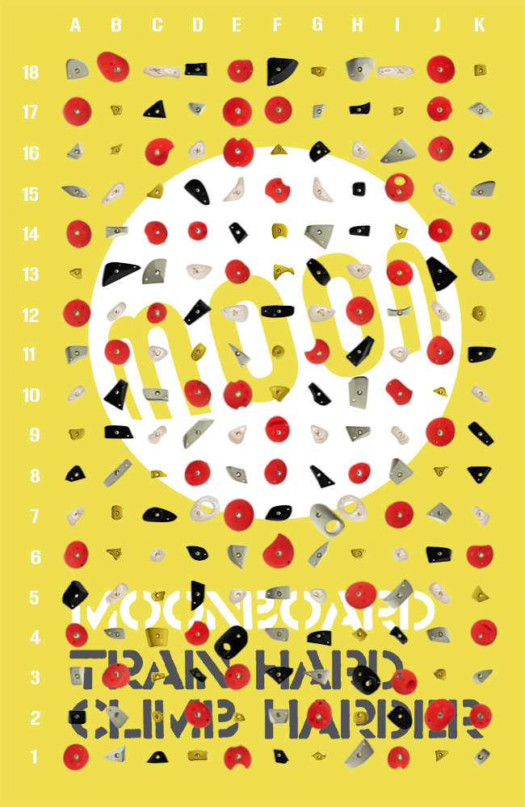

# Climbing route grading classifier

The [moonboard](https://www.moonboard.com) is a climbing training tool.  Each moonboard is a short identical climbing wall with the same holds, at the same orinentation in the same place.  There is a database of approximately 12,000 climbs held on the moonboard website to be used with a mobile app.  Each entry in the database describes which holds to use for the climb, gives it a difficult rating (grade) by given by the route setter and a crowd sourced grade given by the community, who have climbed the route.

Our aim is to predict the climbing grade only given the holds used for a climb.  This is a hard task - one which experienced climbers would find hard to do without climbing the route.  Even after climbing a route the route setter grade and the crowd source grade only agreed 95% of the time.

I train a convolution neural network to classify routes by their grades and achieve 71% accuracy on the test dataset (using a one out accuracy, the true grade can be +- 1 of our guess).  We experiment with three different loss functions to try and take advantage of the ordering of our labels (the grades can be arranged on a number line).  For our loss functions I use:
- CJS (cummlative Jensen-Shannon divergence), https://arxiv.org/pdf/1708.07089.pdf
- Squared earth mover's distance (or Wasserstein metric), https://arxiv.org/pdf/1611.05916.pdf
- Cross-entropy loss (standard loss function for any classification problem, which ignores the orderings of labels)

Our one out accuracy results are:

|Loss function| Accuracy (one out)|
|---|---|
|CJS | 69.4%|
|squared earth mover's distance| 70.8%|
|cross-entropy| 64.2%|

Convolutional neural network model: this model is based upon a 14 layer ResNetv2 but with a few key differences: I add dropout layers and add the scaling of the residuals as in Inception-ResNet (https://arxiv.org/pdf/1602.07261.pdf).

## Tasks and layout of the code
- I scraped the data from the moonboard website in the [scraper notebook](https://nbviewer.jupyter.org/github/luke321321/portfolio/blob/master/climbing/Scraper.ipynb).
- I clean the data and analyise it in the [Data-cleaning-and-analysis notebook](https://nbviewer.jupyter.org/github/luke321321/portfolio/blob/master/climbing/Data-cleaning-and-analysis.ipynb).
- I fit a CNN (convolution neural network) model based upon ResNetv2 in the [CNN notebook](https://nbviewer.jupyter.org/github/luke321321/portfolio/blob/master/climbing/CNN.ipynb).

Result: I achieved 71% accuracy on the test dataset.

A picture of a moonboard:

